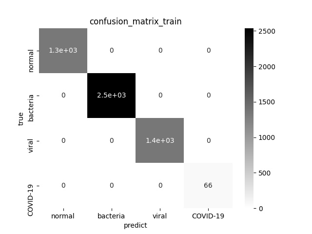
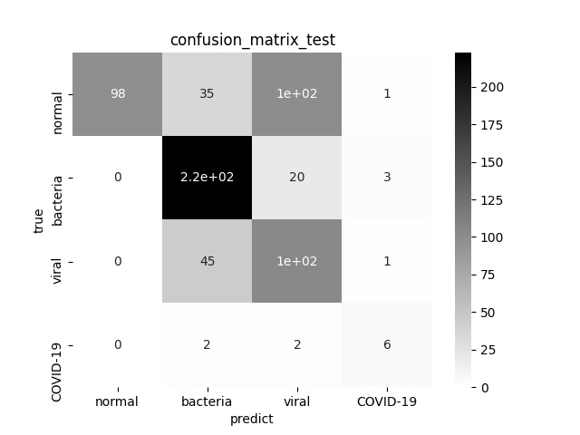

COVID-19 in keras
This repo is inspired by [lindawangg/COVID-Net](https://github.com/lindawangg/COVID-Net). Since the code for model building is not open. I implement the model in Keras(tf2->keras).

All details of model can be found in [paper](assets/COVID_Net.pdf) for [lindawangg/COVID-Net](https://github.com/lindawangg/COVID-Net). 

Notice: This is **not** 100% implement of model in paper. The conv1x1 part is omitted, only the main line with input-> PEPXx.x -> output left.

I trained this model in 100 epoch with result of 100% accuracy and recall in training set, but ~65% in test set. It is overfited obviously.

If better perfermance need, please modify the model or take some trick for training. 

readme.md in [lindawangg/COVID-Net](https://github.com/lindawangg/COVID-Net) when I forked this repo is [there](README-lindawangg-2020.3.27.md).